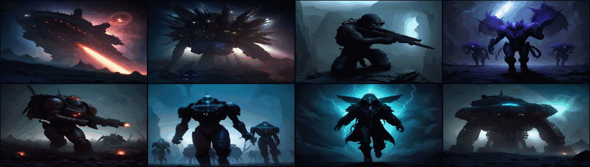

# StarCraft (星际争霸) — Omarchy Theme

A **StarCraft Remastered-style** dark theme for [Omarchy](https://omarchy.org): gauss rifles and psi blades, hive swarms and battlecruiser broadsides — eight battle scenes from the Koprulu sector of 1998, redrawn in high contrast.

The palette wages the trilogy's war in colour — **Terran arc-electric blue against Psi command gold**, with Zerg acid green and creep violet tearing through the middle.



## Install

```bash
omarchy theme install https://github.com/hongyangchun/omarchy-starcraft-theme
```

Or from the desktop: `Super + Alt + Space` → **Install** → **Style** → **Theme**, then paste the repository URL above.

To activate:

```bash
omarchy theme set starcraft
```

## Design Philosophy

- **Background & Canvas (`#0c1220`, `#080b14`)**: The Koprulu star-chart deep space (科普卢深空), deepened into void night (虚空之夜) — the colour of the briefing screen before the drop pods fire.
- **Foreground & Text (`#d9e2ef`, `#f2f7ff`)**: Command console cream-blue (指挥台月白) and psi flash white (灵能闪光白) — terminal green-text heritage, cooled to starlight.
- **Primary Accent (`#e8b64c`)**: **Psi command gold** (幽能指挥金) — the amber HUD highlights of the 1998 briefing UI and the glow of a Protoss shield flare.
- **Secondary Accent (`#3fa7d6`)**: **Terran arc blue** (弧电蓝) — the neon arc light of a Bunker perimeter and the ion trails of a Battlecruiser warp jump.
- **Hyprland Dual-Tone Active Border**: `rgba(e8b64cee) rgba(3fa7d6ee) 45deg` — a 45-degree sweep from Psi gold into arc blue, Protoss meeting Terran.
- **The third war, in the terminal**: Zerg acid green (虫群酸绿 `#7ec850`) for success, creep violet (菌毯紫 `#9d6bba`) for magenta, and Char scorched earth (查尔焦土 `#7a5c42`) for brown — every terminal colour carries a faction.
- **Muted & Selection (`#7a8699`, `#1d2c4e`)**: Spectre grey (幽灵灰) and star-chart navy (星图深蓝) — the tactical map before the first drop.

## Palette Reference

| Token | Hex | Aesthetic / Lore |
|---|---|---|
| `background` | `#0c1220` | 科普卢深空 (Koprulu deep space) |
| `dark_background` | `#080b14` | 虚空之夜 (Void night) |
| `darker_background` | `#05070e` | 跃迁暗影 (Warp shadow) |
| `lighter_background` | `#151f33` | 泰伦舰钢 (Terran hull steel) |
| `foreground` | `#d9e2ef` | 指挥台月白 (Console cream-blue) |
| `bright_foreground` | `#f2f7ff` | 灵能闪光白 (Psi flash white) |
| `accent` | `#e8b64c` | 幽能指挥金 (Psi command gold) |
| `selection` | `#1d2c4e` | 星图深蓝 (Star-chart navy) |
| `muted` | `#7a8699` | 幽灵灰 (Spectre grey) |
| `red` | `#c74a33` | 泰伦锈火 (Terran rust flame) |
| `orange` | `#d97e2e` | 瓦斯琥珀 (Vespene amber) |
| `yellow` | `#e8b64c` | 幽能指挥金 (Psi command gold) |
| `green` | `#7ec850` | 虫群酸绿 (Zerg acid creep) |
| `cyan` | `#54c8d8` | 跃迁青 (Warp gate cyan) |
| `blue` | `#3fa7d6` | 弧电蓝 (Terran arc blue) |
| `magenta` | `#9d6bba` | 菌毯紫 (Creep violet) |
| `brown` | `#7a5c42` | 查尔焦土 (Char scorched earth) |

## Wallpapers (Backgrounds)

13 official StarCraft: Remastered assets, sourced directly from **starcraftremastered.blizzard.com** (Blizzard CDN):

- `sc1-official-terran.jpg` — Terran outpost on red desert (2600×1300)
- `sc1-official-zerg.jpg` — Zerg hive, green mist (2600×1300)
- `sc1-official-protoss.jpg` — Protoss temple, psi blue (2600×1300)
- `sc1-official-finale.jpg` — Finale fleet over planet (2600×1200)
- `sc1-official-hive-door.jpg` — Hive door close-up (2560×1440)
- `sc1-official-gallery-01~08.jpg` — 8 official remastered screenshots (1600×900)

Cycle wallpapers:
```bash
omarchy theme bg next
```

## Icons

Defaulted to `Yaru-contrast-dark` — high-contrast glyphs that hold their own against psi gold.

## License

MIT — see [LICENSE](LICENSE). **Wallpapers are artwork from StarCraft: Remastered © Blizzard Entertainment — included as unofficial fan-theme distribution, all rights belong to Blizzard.** Not affiliated with or endorsed by Blizzard Entertainment.
## Icons

Defaulted to `Yaru-contrast-dark` — high-contrast glyphs that hold their own against psi gold.

## License

MIT — see [LICENSE](LICENSE). **Wallpapers are artwork from StarCraft: Remastered © Blizzard Entertainment — included as unofficial fan-theme distribution, all rights belong to Blizzard.** Not affiliated with or endorsed by Blizzard Entertainment.
## Icons

Defaulted to `Yaru-contrast-dark` — high-contrast glyphs that hold their own against psi gold.

## License

MIT — see [LICENSE](LICENSE). Wallpapers are original AI-generated battle artwork in a retro sci-fi style. StarCraft is a trademark of Blizzard Entertainment; this theme is an unofficial fan work and is not affiliated with or endorsed by Blizzard.
## Icons

Defaulted to `Yaru-contrast-dark` — high-contrast glyphs that hold their own against psi gold.

## License

MIT — see [LICENSE](LICENSE). Wallpapers are original AI-generated artwork in a retro sci-fi style. StarCraft is a trademark of Blizzard Entertainment; this theme is an unofficial fan work and is not affiliated with or endorsed by Blizzard.
